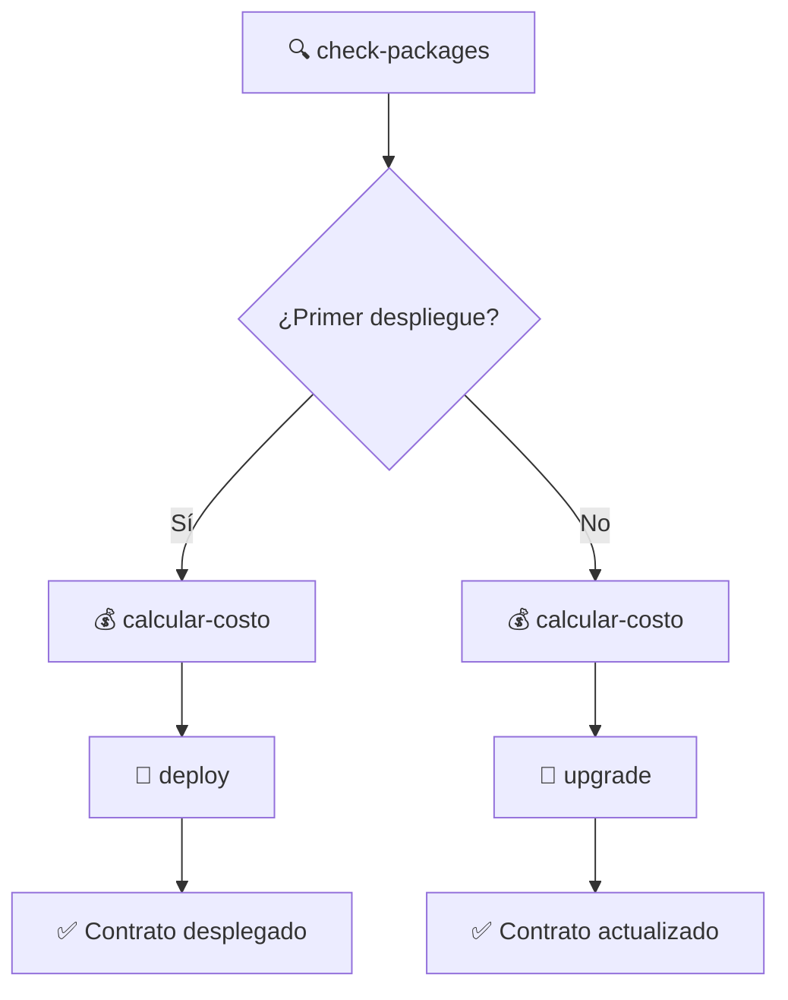

🏠 **Inicio**

# To-Do-Day - Proyecto Sui con Move

## 📦 Sistemas Organizados

### 🗂️ **Packages Manager** - Gestión Completa de Paquetes
Sistema completo organizado para el manejo de paquetes SUI con reportes por tarea.

| Script | Descripción | Ubicación |
|--------|-------------|-----------|
| 🚀 `deploy.ps1` | **Despliegue Inteligente** - Despliega contratos con detección automática de red | [📁 packages-manager/](\.script\packages-manager\README.md) |
| 🔄 `upgrade.ps1` | **Actualización** - Actualiza contratos existentes con UpgradeCaps | [� packages-manager/](\.script\packages-manager\README.md) |
| 📦 `check-packages.ps1` | **Verificación** - Analiza paquetes desplegados con capabilities | [� packages-manager/](\.script\packages-manager\README.md) |
| 🔍 `inspect-package.ps1` | **Inspección** - Análisis detallado de paquetes específicos | [📁 packages-manager/](\.script\packages-manager\README.md) |
| 💰 `calcular-costo-despliegue.ps1` | **Costos** - Estimación de costos con conversión USD | [� packages-manager/](\.script\packages-manager\README.md) |

### � **Wallet Manager** - Gestión Completa de Wallets
Sistema elegante para manejo de wallets con formato visual y reportes organizados.

| Script | Descripción | Ubicación |
|--------|-------------|-----------|
| 💼 `wallet-manager.ps1` | **Gestor Completo** - Wallets con formato visual y consultas multi-red | [� wallet-manager/](.script/wallet-manager/README.md) |

### 🔧 **Scripts Independientes**
| Script | Descripción | Ubicación |
|--------|-------------|-----------|
| 💰 `check-balance.ps1` | **Verificador de Saldos** - Saldos multi-red con conversión USD | [📁 .script/](docs/script/check-balance-script.md) |

[](https://sui.io/)
[](https://move-language.github.io/move/)
[](https://docs.microsoft.com/en-us/powershell/)

Un proyecto completo de desarrollo en Sui utilizando Move como lenguaje de contratos inteligentes, con scripts de automatización avanzados en PowerShell.

## [Tabla de Contenidos](#to-do-day---proyecto-sui-con-move)

- [Tabla de contenidos](#tabla-de-contenidos)
- [Descripción del Proyecto](#descripción-del-proyecto)
- [Scripts de Automatización](#scripts-de-automatización)
- [Inicio Rápido](#inicio-rápido)
- [Documentación Detallada](#documentación-detallada)
- [Configuración](#configuración)
- [Estado del Proyecto](#estado-del-proyecto)
- [Contribuir](#contribuir)
- [Soporte](#soporte)
- [Licencia](#licencia)
- [Próximos Pasos](#próximos-pasos)

---

## [Descripción del Proyecto](#to-do-day---proyecto-sui-con-move)

**To-Do-Day** es un sistema de gestión empresarial desarrollado en la blockchain Sui, que permite:

- **Gestión de Empresas**: Crear y administrar información empresarial
- **Administración de Clientes**: Sistema completo de clientes con descuentos
- **Sistema de Descuentos**: Niveles de descuento basados en tier de cliente
- **Contratos Actualizables**: Soporte para actualizaciones sin perder estado

### Arquitectura del Contrato

```move
// Estructura principal de empresa
struct Empresa {
    id: UID,
    nombre: String,
    descripcion: String,
    clientes: vector<Cliente>,
    // ... más campos
}
```

---

## [Scripts de Automatización](#to-do-day---proyecto-sui-con-move)

Hemos desarrollado un conjunto completo de scripts PowerShell para automatizar todo el ciclo de desarrollo en Sui:

### Directorio `.script/`

| Script | Descripción | Documentación |
|--------|-------------|---------------|
| `deploy.ps1` | **Script Inteligente de Despliegue** - Despliega contratos con detección automática de red y opciones actualizables | [📖 Ver Documentación](docs/deploy-script.md) |
| `upgrade.ps1` | **Script Inteligente de Actualización** - Actualiza contratos existentes con detección automática de UpgradeCaps | [📖 Ver Documentación](docs/upgrade-script.md) |
| `check-packages.ps1` | **Verificador de Paquetes** - Analiza y muestra todos los paquetes desplegados con sus capabilities | [📖 Ver Documentación](docs/check-packages-script.md) |
| `calcular-costo-despliegue.ps1` | **Calculadora de Costos** - Estima costos de despliegue y actualización con conversión a USD | [📖 Ver Documentación](docs/cost-calculator-script.md) |

---

## [Inicio Rápido](#to-do-day---proyecto-sui-con-move)

### **Verificar Estado Actual**

```powershell
.\.script\check-packages.ps1
```

> Muestra todos tus paquetes desplegados y sus UpgradeCaps

### **Calcular Costos**

```powershell
.\.script\calcular-costo-despliegue.ps1 ambos
```

> Calcula costos de despliegue y actualización

### **Desplegar Nuevo Contrato**

```powershell
.\.script\deploy.ps1
```

> Despliega tu contrato con opciones interactivas

### **Actualizar Contrato Existente**

```powershell
.\.script\upgrade.ps1
```

> Actualiza tu contrato manteniendo el mismo Package ID

---

## [Documentación Detallada](#to-do-day---proyecto-sui-con-move)

**[Ver Documentación Completa](docs/documentacion-detallada.md)** - Centro de documentación organizada por categorías

### Acceso Rápido por Categoría

#### Certificación y Guías Oficiales

- **[Sui Certification](docs/Certification/Sui%20Certification%20Day%20Code.md)** - Documentación oficial con capturas paso a paso

#### Scripts de Automatización

- **[Deploy Script](docs/script/deploy-script.md)** - Despliegue inteligente de contratos
- **[Upgrade Script](docs/script/upgrade-script.md)** - Actualizaciones sin perder estado  
- **[Check Packages](docs/script/check-packages-script.md)** - Verificador de paquetes y UpgradeCaps
- **[Cost Calculator](docs/script/cost-calculator-script.md)** - Calculadora de costos SUI/USD

#### Casos de Uso Prácticos

- **[Primer Despliegue](docs/casos-uso/primer-despliegue.md)** - Guía completa para principiantes ✅

#### � Documentos del Proyecto

- **[Contribuir](docs/CONTRIBUTING.md)** - Guía de contribución
- **[Código de Conducta](docs/CODE_OF_CONDUCT.md)** - Normas de la comunidad

---

## [Configuración](#to-do-day---proyecto-sui-con-move)

### Requisitos Previos

- ✅ **Sui CLI** v1.57.0+
- ✅ **PowerShell** 7.0+
- ✅ **Move** Compiler
- ✅ **Git** (opcional)

### Configuración Inicial

```powershell
# 1. Verificar instalación de Sui
sui --version

# 2. Configurar wallet
sui client active-address

# 3. Verificar red activa
sui client active-env

# 4. Ejecutar verificación completa
.\.script\check-packages.ps1 -Detallado
```

### Configuración de Redes

| Red | Propósito | Costo Estimado |
|-----|-----------|----------------|
| **testnet** | Desarrollo y pruebas | ~0.01 SUI |
| **mainnet** | Producción | ~0.39 SUI |
| **devnet** | Desarrollo local | Gratuito |

---

## [Estado del Proyecto](#to-do-day---proyecto-sui-con-move)

### Métricas de Desarrollo

- **Scripts Implementados**: 4/4 (100%)
- **Funcionalidad**: Completa con detección automática
- **UX**: Interface interactiva con emojis y colores
- **Compatibilidad**: PowerShell 7.0+ en Windows
- **Seguridad**: Validaciones y confirmaciones incluidas
- **Licencia**: MIT License implementada
- **Código de Conducta**: Políticas de comunidad establecidas

### Funcionalidades Destacadas

- ✅ **Detección Automática** de UpgradeCaps y Package IDs
- ✅ **Selección Interactiva** de redes y opciones
- ✅ **Verificación de Balance** antes de operaciones
- ✅ **Cálculo de Costos** con conversión USD
- ✅ **Sistema de Archivos** para tracking de despliegues
- ✅ **Manejo Robusto de Errores** con mensajes claros
- ✅ **Documentación Completa** con ejemplos

### Flujo de Trabajo Optimizado



---

## [Contribuir](#to-do-day---proyecto-sui-con-move)

¡Las contribuciones son bienvenidas! Por favor lee nuestro [Código de Conducta](CODE_OF_CONDUCT.md) antes de participar.

### 📋 Proceso de Contribución

1. 🍴 **Fork** el proyecto
2. 🌟 **Crea** tu feature branch (`git checkout -b feature/AmazingFeature`)
3. 💾 **Commit** tus cambios (`git commit -m 'Add some AmazingFeature'`)
4. 📤 **Push** al branch (`git push origin feature/AmazingFeature`)
5. 🔀 **Abre** un Pull Request

### Código de Conducta

Este proyecto adhiere al [Código de Conducta](CODE_OF_CONDUCT.md). Al participar, se espera que mantengas este código. Por favor reporta comportamiento inaceptable al equipo del proyecto.

### Tipos de Contribuciones

- **Reportar bugs** y problemas
- **Sugerir nuevas funcionalidades**
- **Mejorar documentación**
- **Contribuir código** y mejoras
- **Probar** en diferentes entornos

---

## [Soporte](#to-do-day---proyecto-sui-con-move)

- **Documentación**: Ver carpeta `docs/`
- **Contribuir**: Lee nuestra [Guía de Contribución](./docs/CONTRIBUTING.md)
- **Reportar Bugs**: [Usar plantilla de bug report](https://github.com/Dc-Dev-Prog/to-do-day/issues/new?template=bug_report.md)
- **Solicitar Features**: [Usar plantilla de feature request](https://github.com/Dc-Dev-Prog/to-do-day/issues/new?template=feature_request.md)
- **Hacer Preguntas**: [Usar plantilla de pregunta](https://github.com/Dc-Dev-Prog/to-do-day/issues/new?template=question.md)
- **Discusiones**: [Comunidad](https://github.com/Dc-Dev-Prog/to-do-day/discussions)
- **Email**: [Contacto directo](mailto:dcdevtk@gmail.com)

---

## [Licencia](#to-do-day---proyecto-sui-con-move)

Este proyecto está bajo la Licencia MIT - ver el archivo [LICENSE](LICENSE) para más detalles.

---

## [Próximos Pasos](#to-do-day---proyecto-sui-con-move)

1. **Lee la documentación** específica del script que necesites
2. **Ejecuta el flujo** de verificación → cálculo → despliegue/actualización
3. **Experimenta** con diferentes opciones y redes
4. **¡Desarrolla en Sui!** con confianza usando nuestros scripts

---

**🚀 ¡Feliz desarrollo en Sui con Move! 🎉**

**Creado con ❤️ por el equipo de desarrollo de [Dc Studio]()**
