```mermaid
graph TD
    A[🔍 check-packages] --> B{¿Primer despliegue?}
    B -->|Sí| C[💰 calcular-costo]
    B -->|No| D[💰 calcular-costo]
    C --> E[🚀 deploy]
    D --> F[🔄 upgrade]
    E --> G[✅ Contrato desplegado]
    F --> H[✅ Contrato actualizado]
```

# 🚀 To-Do-Day - Proyecto Sui con Move

[](https://sui.io/)
[](https://move-language.github.io/move/)
[](https://docs.microsoft.com/en-us/powershell/)

Un proyecto completo de desarrollo en Sui utilizando Move como lenguaje de contratos inteligentes, con scripts de automatización avanzados en PowerShell.

## 📋 Tabla de Contenidos

- [🎯 Descripción del Proyecto](#descripción-del-proyecto)
- [🛠️ Scripts de Automatización](#scripts-de-automatización)
- [🚀 Inicio Rápido](#inicio-rápido)
- [📖 Documentación Detallada](#documentación-detallada)
- [🔧 Configuración](#configuración)
- [📊 Estado del Proyecto](#estado-del-proyecto)
- [🤝 Contribuir](#contribuir)
- [📞 Soporte](#soporte)
- [📄 Licencia](#licencia)

---

## 🎯 Descripción del Proyecto

**To-Do-Day** es un sistema de gestión empresarial desarrollado en la blockchain Sui, que permite:

- 📊 **Gestión de Empresas**: Crear y administrar información empresarial
- 👥 **Administración de Clientes**: Sistema completo de clientes con descuentos
- 🎯 **Sistema de Descuentos**: Niveles de descuento basados en tier de cliente
- 🔄 **Contratos Actualizables**: Soporte para actualizaciones sin perder estado

### 🏗️ Arquitectura del Contrato

```move
// Estructura principal de empresa
struct Empresa {
    id: UID,
    nombre: String,
    descripcion: String,
    clientes: vector<Cliente>,
    // ... más campos
}
```

---

## 🛠️ Scripts de Automatización

Hemos desarrollado un conjunto completo de scripts PowerShell para automatizar todo el ciclo de desarrollo en Sui:

### 📁 Directorio `.script/`

| Script | Descripción | Documentación |
|--------|-------------|---------------|
| 🚀 `deploy.ps1` | **Script Inteligente de Despliegue** - Despliega contratos con detección automática de red y opciones actualizables | [📖 Ver Documentación](docs/deploy-script.md) |
| 🔄 `upgrade.ps1` | **Script Inteligente de Actualización** - Actualiza contratos existentes con detección automática de UpgradeCaps | [📖 Ver Documentación](docs/upgrade-script.md) |
| 📦 `check-packages.ps1` | **Verificador de Paquetes** - Analiza y muestra todos los paquetes desplegados con sus capabilities | [📖 Ver Documentación](docs/check-packages-script.md) |
| 💰 `calcular-costo-despliegue.ps1` | **Calculadora de Costos** - Estima costos de despliegue y actualización con conversión a USD | [📖 Ver Documentación](docs/cost-calculator-script.md) |

---

## 🚀 Inicio Rápido

### 1️⃣ **Verificar Estado Actual**
```powershell
.\.script\check-packages.ps1
```
> 📋 Muestra todos tus paquetes desplegados y sus UpgradeCaps

### 2️⃣ **Calcular Costos**
```powershell
.\.script\calcular-costo-despliegue.ps1 ambos
```
> 💰 Calcula costos de despliegue y actualización

### 3️⃣ **Desplegar Nuevo Contrato**
```powershell
.\.script\deploy.ps1
```
> 🚀 Despliega tu contrato con opciones interactivas

### 4️⃣ **Actualizar Contrato Existente**
```powershell
.\.script\upgrade.ps1
```
> 🔄 Actualiza tu contrato manteniendo el mismo Package ID

---

## 📖 Documentación Detallada

### � Documentación Oficial

- **[🏆 Sui Certification Day Code](docs/Sui%20Certification%20Day%20Code.md)** - Documentación oficial de certificación con guías paso a paso para el desarrollo en Sui y Move

### �📚 Guías Completas por Script

- **[🚀 Script de Despliegue](docs/deploy-script.md)**
  - Configuración de red automática
  - Opciones de despliegue actualizable vs inmutable
  - Verificación de balance y compilación
  - Ejemplos de uso avanzado

- **[🔄 Script de Actualización](docs/upgrade-script.md)**
  - Detección automática de UpgradeCaps
  - Selección inteligente de paquetes
  - Proceso de actualización paso a paso
  - Manejo de errores y troubleshooting

- **[📦 Verificador de Paquetes](docs/check-packages-script.md)**
  - Análisis completo de paquetes desplegados
  - Visualización de UpgradeCaps disponibles
  - Estadísticas y métricas
  - Modos de visualización

- **[💰 Calculadora de Costos](docs/cost-calculator-script.md)**
  - Estimación de costos en SUI y USD
  - Diferentes modos de cálculo
  - Verificación de balance
  - Planificación financiera

### 📚 Casos de Uso Específicos

- **[🆕 Primer Despliegue](docs/casos-uso/primer-despliegue.md)** - Guía para principiantes ✅
- **🔄 Actualización de Contratos** - Flujo de actualización 🚧 *En desarrollo*
- **🌐 Cambio de Redes** - Testnet, Mainnet, Devnet 🚧 *En desarrollo*
- **🐛 Solución de Problemas** - Errores comunes 🚧 *En desarrollo*

---

## 🔧 Configuración

### 📋 Requisitos Previos

- ✅ **Sui CLI** v1.57.0+
- ✅ **PowerShell** 7.0+
- ✅ **Move** Compiler
- ✅ **Git** (opcional)

### ⚙️ Configuración Inicial

```powershell
# 1. Verificar instalación de Sui
sui --version

# 2. Configurar wallet
sui client active-address

# 3. Verificar red activa
sui client active-env

# 4. Ejecutar verificación completa
.\.script\check-packages.ps1 -Detallado
```

### 🌐 Configuración de Redes

| Red | Propósito | Costo Estimado |
|-----|-----------|----------------|
| 🧪 **testnet** | Desarrollo y pruebas | ~0.01 SUI |
| 🌐 **mainnet** | Producción | ~0.39 SUI |
| 🔧 **devnet** | Desarrollo local | Gratuito |

---

## 📊 Estado del Proyecto

### 📈 Métricas de Desarrollo

- 🎯 **Scripts Implementados**: 4/4 (100%)
- 🔧 **Funcionalidad**: Completa con detección automática
- 🎨 **UX**: Interface interactiva con emojis y colores
- 📱 **Compatibilidad**: PowerShell 7.0+ en Windows
- 🔒 **Seguridad**: Validaciones y confirmaciones incluidas
- 📄 **Licencia**: MIT License implementada
- 🛡️ **Código de Conducta**: Políticas de comunidad establecidas

### 🎉 Funcionalidades Destacadas

- ✅ **Detección Automática** de UpgradeCaps y Package IDs
- ✅ **Selección Interactiva** de redes y opciones
- ✅ **Verificación de Balance** antes de operaciones
- ✅ **Cálculo de Costos** con conversión USD
- ✅ **Sistema de Archivos** para tracking de despliegues
- ✅ **Manejo Robusto de Errores** con mensajes claros
- ✅ **Documentación Completa** con ejemplos

### 🏆 Flujo de Trabajo Optimizado



---

## 🤝 Contribuir

¡Las contribuciones son bienvenidas! Por favor lee nuestro [Código de Conducta](CODE_OF_CONDUCT.md) antes de participar.

### 📋 Proceso de Contribución

1. 🍴 **Fork** el proyecto
2. 🌟 **Crea** tu feature branch (`git checkout -b feature/AmazingFeature`)
3. 💾 **Commit** tus cambios (`git commit -m 'Add some AmazingFeature'`)
4. 📤 **Push** al branch (`git push origin feature/AmazingFeature`)
5. 🔀 **Abre** un Pull Request

### 🛡️ Código de Conducta

Este proyecto adhiere al [Código de Conducta](CODE_OF_CONDUCT.md). Al participar, se espera que mantengas este código. Por favor reporta comportamiento inaceptable al equipo del proyecto.

### 🎯 Tipos de Contribuciones

- 🐛 **Reportar bugs** y problemas
- 💡 **Sugerir nuevas funcionalidades**
- 📝 **Mejorar documentación**
- 🔧 **Contribuir código** y mejoras
- 🧪 **Probar** en diferentes entornos

---

## 📞 Soporte

- 📖 **Documentación**: Ver carpeta `docs/`
- 🐛 **Issues**: [Reportar problemas](https://github.com/Dc-Dev-Prog/to-do-day/issues)
- 💬 **Discusiones**: [Comunidad](https://github.com/Dc-Dev-Prog/to-do-day/discussions)
- 📧 **Email**: [Contacto directo](mailto:dcdevtk@gmail.com)

---

## 📄 Licencia

Este proyecto está bajo la Licencia MIT - ver el archivo [LICENSE](LICENSE) para más detalles.

---

## 🎯 Próximos Pasos

1. 📖 **Lee la documentación** específica del script que necesites
2. 🚀 **Ejecuta el flujo** de verificación → cálculo → despliegue/actualización  
3. 💡 **Experimenta** con diferentes opciones y redes
4. 🎉 **¡Desarrolla en Sui!** con confianza usando nuestros scripts

---

<div align="center">

**🚀 ¡Feliz desarrollo en Sui con Move! 🎉**

*Creado con ❤️ por el equipo de desarrollo*

</div>